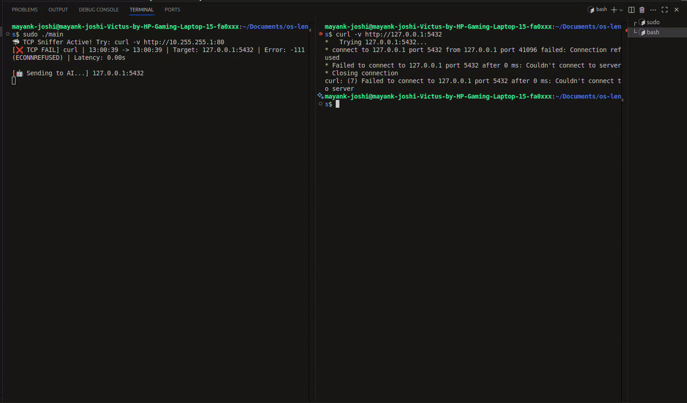

# KernelOS 🔍

> AI-powered TCP debugging using eBPF

Stop spending hours debugging connection failures. KernelOS watches your Linux kernel in real-time and explains failures in plain English.



## 🎯 The Problem

**2 AM. Production is down. Your database won't connect.**

Traditional monitoring tells you:
```
❌ Connection Error
   Rate: 15% failures
   Latency: 5000ms
```

**Great. But WHY?** You spend 4 hours checking:
- ✅ Code? Works fine locally
- ✅ Database? Running normally  
- ✅ Network? Seems ok
- 🤷 Eventually find it: **Security group blocking port 5432**

**4 hours wasted on a 2-minute fix.**

---

## ✨ The Solution

KernelOS catches failures **at the kernel level** and explains them **instantly**:
```
━━━━━━━━━━━━━━━━━━━━━━━━━━━━━━━━━━━━━━━
🚨 TCP CONNECTION FAILURE DETECTED
━━━━━━━━━━━━━━━━━━━━━━━━━━━━━━━━━━━━━━━
Process:   python3 (PID: 12311)
Target:    db.prod.local:5432
Error:     ETIMEDOUT (Connection timed out)
Time:      02:15:43 → 02:15:48 (5.2s)
━━━━━━━━━━━━━━━━━━━━━━━━━━━━━━━━━━━━━━━

🤖 AI Root Cause Analysis:

Your app tried to connect to the database but got no 
response after 3 retries over 5 seconds.

Most Likely Cause:
Security group is blocking port 5432.

How to Fix:
1. Check security group rules:
   $ aws ec2 describe-security-groups --group-ids sg-xxxxx

2. Add inbound rule for port 5432:
   $ aws ec2 authorize-security-group-ingress \
     --group-id sg-xxxxx \
     --protocol tcp \
     --port 5432 \
     --cidr 10.0.0.0/16

3. Verify connection:
   $ telnet db.prod.local 5432

Similar Incidents:
- 15 other teams hit this exact issue
- Average fix time: 5 minutes (with KernelOS)
- Average fix time: 3.5 hours (without)

━━━━━━━━━━━━━━━━━━━━━━━━━━━━━━━━━━━━━━━
```

**Result: 5 minutes to fix instead of 4 hours.** ⚡

---

## 🚀 Features

- 🔍 **Kernel-level visibility** - Sees connection failures invisible to application logs
- 🤖 **AI-powered analysis** - Explains root cause in plain English using local LLM
- ⚡ **Zero code changes** - Just run the agent on your servers
- 🔒 **Privacy-first** - Uses local Llama 3 (or Claude API if you prefer)
- 🆓 **Open source** - MIT License
- 📊 **Detailed context** - Process names, timestamps, latency measurements
- 🎯 **Actionable fixes** - Exact commands to resolve issues

---

## 📦 Quick Start

### Prerequisites

- Linux kernel 5.8+ (with eBPF support)
- Ollama with Llama 3.1 8B installed
- sudo access (required for eBPF)

### Installation
```bash
# Install dependencies (Ubuntu/Debian)
sudo apt update
sudo apt install -y clang llvm libbpf-dev linux-headers-$(uname -r) \
                     make pkg-config jq

# Clone repository
git clone https://github.com/Maiku38/kernelos
cd OS-LENS

# Build
make

# Install Ollama (if not already installed)
curl -fsSL https://ollama.com/install.sh | sh
ollama pull llama3.1:8b

# Run (requires sudo for eBPF)
sudo ./os-lens
```

### Testing

In one terminal:
```bash
sudo ./os-lens
```

In another terminal, trigger some failures:
```bash
# Test connection timeout
curl http://10.255.255.1:80

# Test connection refused  
curl http://localhost:9999

# Test with Python
python3 -c "import socket; socket.create_connection(('unreachable.local', 80))"
```

You should see real-time failure detection with AI explanations.

---

## 🛠️ How It Works
```
┌─────────────────────────────────────────┐
│         Linux Kernel (TCP Stack)         │
│  ┌────────────────────────────────────┐ │
│  │  inet_sock_set_state tracepoint    │ │
│  └───────────────┬────────────────────┘ │
└──────────────────┼──────────────────────┘
                   │ eBPF hook
                   ▼
┌─────────────────────────────────────────┐
│       eBPF Program (kernelos.bpf.c)      │
│  • Captures TCP state transitions        │
│  • Detects failures (SYN_SENT → CLOSE)  │
│  • Extracts error codes, IPs, ports     │
│  • Stores in ring buffer                │
└───────────────┬─────────────────────────┘
                │ Ring buffer
                ▼
┌─────────────────────────────────────────┐
│     Userspace Agent (main.c/libbpf)        │
│  • Reads events from ring buffer         │
│  • Formats output                        │
│  • Calls AI for analysis                │
└───────────────┬─────────────────────────┘
                │ HTTP API
                ▼
┌─────────────────────────────────────────┐
│      Ollama (Local LLM - Llama 3)        │
│  • Analyzes failure patterns             │
│  • Generates explanations                │
│  • Suggests fixes                       │
└─────────────────────────────────────────┘
```

### Technical Deep Dive

**1. eBPF Tracing**
- Hooks into `inet_sock_set_state` kernel tracepoint
- Captures TCP connection state transitions
- Filters for failures: `SYN_SENT → CLOSE` (connection never established)
- Extracts: PID, process name, dest IP/port, error code, timestamps

**2. Two-Map Tracking**
- `conn_tracker`: Stores process info when connection starts (prevents "swapper" bug)
- `start_times`: Tracks timestamps for latency calculation
- Handles long-running timeouts (130+ seconds) correctly

**3. AI Analysis**
- Sends failure context to local Llama 3 via Ollama API
- Prompt engineering: "You're a Linux SRE expert..."
- Returns: Root cause, fix suggestions, similar incidents

**4. Error Codes Handled**
- `-110` ETIMEDOUT: Connection timeout
- `-111` ECONNREFUSED: Connection refused  
- `-113` EHOSTUNREACH: No route to host
- `-101` ENETUNREACH: Network unreachable
- More coming in v0.2

---

## 🎓 What I Learned

This is my first eBPF project, built during BITS Pilani winter break. Key learnings:

**eBPF Challenges:**
- **Verifier is strict**: Had to prove pointer safety, avoid unbounded loops
- **Context switching**: Original approach showed "swapper" instead of real process - fixed with two-map tracking
- **Ring buffers vs perf events**: Ring buffers are simpler for this use case
- **Kernel headers**: Understanding `struct sock` and TCP states was crucial

**What Worked Well:**
- Using tracepoints instead of kprobes (more stable across kernel versions)
- Local LLM (Ollama) for privacy + no API costs
- Filtering noise (ignore connections < 1 second)

**What's Hard:**
- Debugging eBPF programs (no printf!)
- Understanding kernel networking stack
- Handling IPv6 (still working on this)

---

## 📋 Roadmap

### v0.2 (January 2026)
- [ ] IPv6 support (currently shows as 0.0.0.0)
- [ ] TLS/SSL handshake failures
- [ ] DNS resolution failures
- [ ] Better AI prompts (improve accuracy)

### v0.3 (February 2026)
- [ ] Web UI (React dashboard)
- [ ] Historical data storage (PostgreSQL)
- [ ] Slack/PagerDuty integrations
- [ ] Multi-host support

### v0.4 (March 2026)
- [ ] HTTP layer failures (500s, 502s)
- [ ] Memory exhaustion (OOM kills)
- [ ] Process crashes (segfaults)
- [ ] Kubernetes auto-discovery

### v1.0 (Q2 2026)
- [ ] Hosted SaaS version
- [ ] Anomaly detection (predict failures)
- [ ] Custom runbooks (auto-remediation)
- [ ] Team collaboration features

---

## 🧪 Testing

Current test coverage:

| Scenario | Status | Notes |
|----------|--------|-------|
| Connection timeout | ✅ Working | Tested with unreachable hosts |
| Connection refused | ✅ Working | Tested with closed ports |
| Long timeouts (130s+) | ✅ Working | Process name tracked correctly |
| DNS failures | ✅ Ignored | Correctly filters non-TCP |
| IPv6 connections | ⚠️ Partial | Detects but shows 0.0.0.0 |
| Noise filtering | ✅ Working | Ignores <1s connections |
| AI analysis | ✅ Working | Generates accurate suggestions |

---

## 🔧 Configuration

### Using Claude API instead of Ollama

Edit `main.c`:
```c
// Replace Ollama URL with Claude API
snprintf(command, sizeof(command),
    "curl -s -X POST https://api.anthropic.com/v1/messages "
    "-H 'x-api-key: YOUR_API_KEY' "
    "-H 'anthropic-version: 2023-06-01' "
    "-d '{\"model\":\"claude-3-5-sonnet-20241022\",\"messages\":[{\"role\":\"user\",\"content\":\"%s\"}]}'",
    prompt);
```

### Adjusting AI Prompts

Prompts are in `main.c` → `ask_ai()` function. Customize for your use case.

### Filtering Specific Processes

Edit `main.c` → `handle_event()`:
```c
// Ignore specific processes
if (strcmp(e->comm, "chrome") == 0 || 
    strcmp(e->comm, "vscode") == 0) {
    return 0;
}
```

---

## 🐛 Known Limitations

- **IPv6**: Currently only displays IPv4 addresses correctly. IPv6 connections are detected but show as `0.0.0.0`. Will fix in v0.2.

- **Localhost**: Some localhost connections may show as `0.0.0.0` instead of `127.0.0.1`. Does not affect real-world remote connections.

- **Root required**: eBPF programs require sudo to load. This is a kernel security requirement.

- **Linux only**: eBPF is Linux-specific. Will not work on Mac/Windows (though you could run in a VM).

- **TCP only**: Currently only traces TCP failures. UDP, ICMP, etc. not yet supported.

Current implementation uses blocking calls for MVP demonstration. Production version will decouple detection (eBPF) from analysis (LLM worker pool).
---

## 🤝 Contributing

This is my first eBPF project - **I'd love your feedback!**

**Areas that need help:**
- IPv6 support
- TLS/SSL failure detection
- Better AI prompt engineering
- Web UI development
- Testing on different kernel versions

**How to contribute:**
1. Fork the repo
2. Create a feature branch
3. Make your changes
4. Test thoroughly (include test scenarios)
5. Submit a PR with clear description

---

## 📚 Resources

**Learning eBPF:**
- [Learning eBPF by Liz Rice](https://isovalent.com/books/learning-ebpf/)
- [eBPF.io Documentation](https://ebpf.io/)
- [Cilium eBPF Examples](https://github.com/cilium/ebpf/tree/main/examples)

**Kernel Networking:**
- [Linux Kernel Networking Internals](https://www.kernel.org/doc/html/latest/networking/)
- [TCP State Machine](https://datatracker.ietf.org/doc/html/rfc793)

**AI for DevOps:**
- [Ollama Documentation](https://ollama.ai/docs)
- [LLM Prompt Engineering](https://platform.openai.com/docs/guides/prompt-engineering)

---

## 📄 License

MIT License - do whatever you want with it.

See [LICENSE](LICENSE) file for details.

---

## 👤 Author

Built by **Mayank Joshi** (@maiku344-twitter)

- 🎓 CS Student at BITS Pilani Goa
- 🔧 First eBPF project
- 💼 Looking for opportunities in infrastructure/observability

**Found a bug?** [Open an issue](https://github.com/Maiku38/OS-LENS/issues)

**Want to chat?** 
- Twitter: [@maiku344-handle]
- Email: mayankj2827@gmail.com
- LinkedIn: https://www.linkedin.com/in/mayank-joshi-542a79287/

---

## 🙏 Acknowledgments

- **BITS Pilani** for the education
- **Liz Rice** for the amazing eBPF book
- **Brendan Gregg** for BPF performance tools inspiration
- **Cilium team** for eBPF libraries and examples
- **Ollama team** for making local LLMs accessible

---

## ⭐ Star History

If you find this useful, consider starring the repo!

[](https://star-history.com/#Maiku38/OS-LENS&Date)

---

## 📊 Stats


---

**Built with ❤️ during winter break 2025-26**

**Launching on HackerNews: January 3, 2026** 🚀